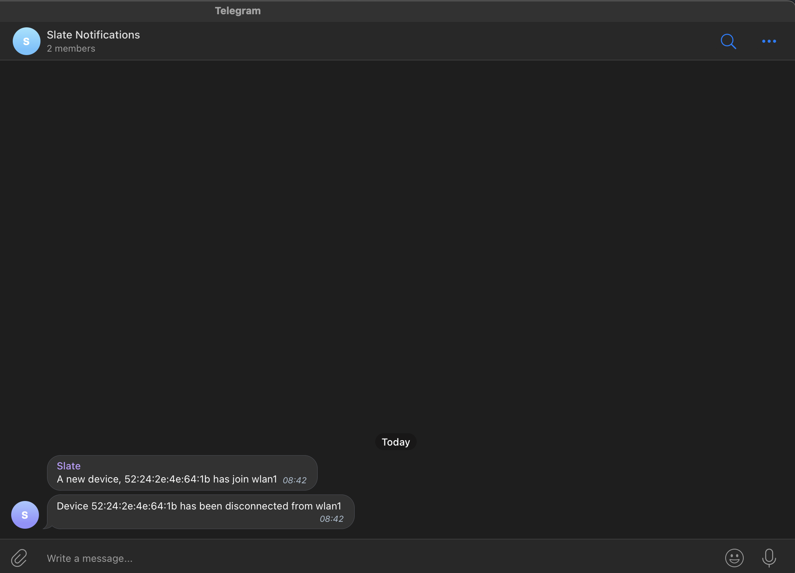

# OpenWRT Device Notification System

While travelling, I was in need of a travel router as I was using a VPN for all my devices, so I picked up a Raspberry Pi
and installed [OpenWRT](https://openwrt.org/) on it which comes with a load of cool features out of the box. 
One feature which I wanted was a way to easily be notified on when a device had connected to the router.

When thinking about how I could do this I had Telegram in mind as I could set up a bot and use the API to send messages 
and monitor it that way. Before I could use the API bot I needed a way to run a script when either a new device connected
or disconnected from the router. To do this I used [hostapd-utils](https://www.systutorials.com/docs/linux/man/1-hostapd_cli/) 
which is a process that when configured will run a script on a selected interface when a device connects or disconnects.

To get started I first need to create a Telegram bot which I can use for delivering updates on connected devices.

### Creating a Telegram bot
To create a bot I used the [BotFather](https://t.me/BotFather) on Telegram which makes it very easy to 
create a bot. Below you will see a Bot created called "Slate" which in this case is the router:

````text
/newbot

Alright, a new bot. How are we going to call it? Please choose a name for your bot.

slate

Good. Now let's choose a username for your bot. It must end in `bot`. Like this, for example: TetrisBot or tetris_bot.

slate_openwrt_bot

Done! Congratulations on your new bot. You will find it at t.me/slate_openwrt_bot. You can now add a description, about 
section and profile picture for your bot, see /help for a list of commands. By the way, when you've finished creating 
your cool bot, ping our Bot Support if you want a better username for it. Just make sure the bot is fully operational 
before you do this.

Use this token to access the HTTP API:
2067182455:AAF_xxxxxxxxxxxxxxxxxxxxxxx
Keep your token secure and store it safely, it can be used by anyone to control your bot.

For a description of the Bot API, see this page: https://core.telegram.org/bots/api

````

The next step is to create a new group on Telegram and invite the newly created bot to it, in my case I called the group
"Slate Notification". Once you have the bot added to the group chat you can gather updates for the both using the `getUpdate` method.
```shell
curl https://api.telegram.org/bot$APIKEY/getUpdates| jq
```

From the output you will be able to see events on when the bot was added to the group chat for notifications but the
main value we need to take from the output is the chat id number as we will need this for sending messages to via the API:
````json
 "message": {
        "message_id": 11,
        "from": {
          "id": 590969550,
          "is_bot": false,
          "first_name": "Cathal",
          "username": "XX",
          "language_code": "en"
        },
        "chat": {
          "id": -720111558,
          "title": "Slate Notifications",
          "type": "group",
          "all_members_are_administrators": true
        },
        "date": 1648885315,
        "new_chat_participant": {
          "id": 2067182455,
          "is_bot": true,
          "first_name": "Slate",
          "username": "slate_openwrt_bot"
        },
        "new_chat_members": [
          {
            "id": 2067182455,
            "is_bot": true,
            "first_name": "Slate",
            "username": "slate_openwrt_bot"
          }
````

From the above output we can see that the group chat id is `-720111558` and we can check this by using `getChat` method
and passing it the id `-720111558`:

```shell 
curl https://api.telegram.org/bot$APIKEY/getChat?chat_id=-720111558 | jq
```

```json
"ok": true,
    "result": {
        "id": -720111558,
        "title": "Slate Notifications",
        "type": "group",
        "description": "OpenWRT Notifications",
        "permissions": {
            "can_send_messages": true,
            "can_send_media_messages": true,
            "can_send_polls": true,
            "can_send_other_messages": true,
            "can_add_web_page_previews": true,
            "can_change_info": true,
            "can_invite_users": true,
            "can_pin_messages": true
        },
        "all_members_are_administrators": true
    }
```

Now that we have the bot set up, added to the notification group chat lets test sending a message as Slate to the group
chat:

```shell
curl https://api.telegram.org/bot$APIKEY/sendMessage?chat_id=-720111558&text="Hello World!"
```

```json
 "ok": true,
    "result": {
        "message_id": 12,
        "from": {
            "id": 2067182455,
            "is_bot": true,
            "first_name": "Slate",
            "username": "slate_openwrt_bot"
        },
        "chat": {
            "id": -720111558,
            "title": "Slate Notifications",
            "type": "group",
            "all_members_are_administrators": true
        },
        "date": 1648886937,
        "text": "\"Hello World!\""
    }

```

As you can see from above I have now sent a "Hello World!" message to a notification group chat using a bot!

### Script and Router Configuration
In order to monitor connection events [hostapd-utils](https://www.systutorials.com/docs/linux/man/1-hostapd_cli/) will need
to first be installed if not already. Opkg can be used to install this package by running the command 
`opkg install hostapd-utils`

To view interfaces on OpenWRT, run the command `iwinfo`. Make note of the interface you wish to monitor events on
as this will be needed with `hostapd_cli`. In my case I will be using **wlan1**:
```shell
wlan1     ESSID: "Slate-Router"
          Access Point: 94:83:C4:10:BC:06
          Mode: Master  Channel: 1 (2.412 GHz)
          Tx-Power: 20 dBm  Link Quality: unknown/70
          Signal: unknown  Noise: -72 dBm
          Bit Rate: unknown
          Encryption: WPA2 PSK (CCMP)
          Type: nl80211  HW Mode(s): 802.11bgn
          Hardware: unknown [Generic MAC80211]
          TX power offset: unknown
          Frequency offset: unknown
          Supports VAPs: yes  PHY name: phy1
```

The final piece needed before putting this all together is a shell script which will be in charge or sending the 
messages to the chat, this script is called `event_listener.sh`. `hostapd_cli` has three environment variables which 
is uses when monitoring events:

| Variable | Description        |
|----------|--------------------|
| $1       | Interface          |
| $2       | Action Event       |
| $3       | Device MAC Address |

These variables are useful as firstly I can use the action event to set up an if statement for both `AP-STA-CONNECTED`
and `AP-STA-DISCONNECTED`. This will then allow me to use the interface and mac address variables to create a message 
to send to the chat using the bot:

```shell
#!/bin/bash

TELEGRAM_BOT="https://api.telegram.org/bot$API_KEY/sendMessage?chat_id=$GROUP_CHAT_ID&text="

if [[ $2 == "AP-STA-CONNECTED" ]]
then
    TEXT="A new device, $3 has join $1"
    message=$(/usr/bin/curl "$TELEGRAM_BOT$TEXT")
fi

if [[ $2 == "AP-STA-DISCONNECTED" ]]
then
    TEXT="Device $3 has been disconnected from $1"
    message=$(/usr/bin/curl "$TELEGRAM_BOT$TEXT")
fi
```

### How to run
Finally, to put this all together to run it, I placed the `event_listener.sh` script in the root directory, 
made it executable `chmod +x event_listener.sh` and ran:
```shell
hostapd_cli -a/root/event_listener.sh -B -iwlan1
```
The flag `-a` allows a file to be excluded when an event takes place.<br>
The flag `-B` allows the process to run in th background.<br>
The flag `-i` in the interface to monitor.

Now when I connect and disconnect a device I can see messages in the chat from the bot!


As I was using this on the go the final part was to configure the script to start when the router was booting. To do this
I edited `/etc/rc.local` and added:
```shell
sleep 10

/usr/sbin/hostapd_cli -a/root/event_listener.sh -B -iwlan1
```

### Conclusion & Recommendations
Overall I found it a really enjoyable and quick way to put together a notification system. It also thought me a lot
more about OpenWRT which is a fantastic open-source project. Future recommendations for this project would be to manage 
a list of known connected devices and also try to gather and provide a more in-dept report via the notification system.

### References
* https://www.systutorials.com/docs/linux/man/8-hostapd/
* https://www.systutorials.com/docs/linux/man/1-hostapd_cli/
* https://forum.openwrt.org/t/solved-assoc-disassoc-event-trigger/3341
* https://openwrt.org/
* https://core.telegram.org/methods


